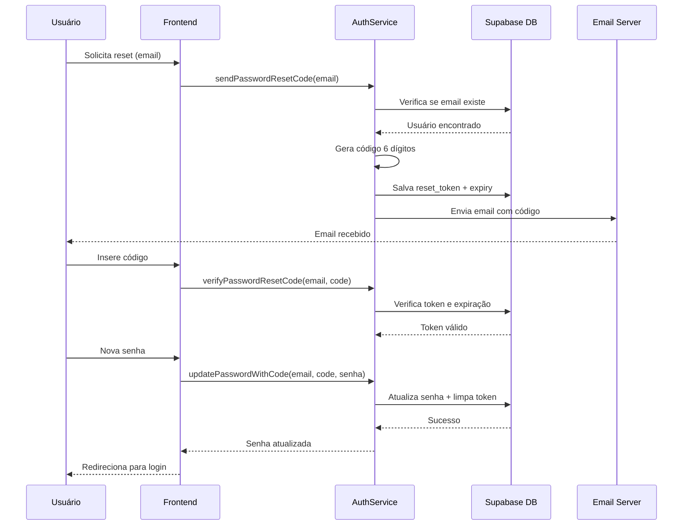

# ✅ Correção do Erro: Reset de Senha

## 🔴 Problema Original

```
AuthApiError: Database error finding user
```

A aplicação tentava usar `signInWithOtp` do Supabase Auth, mas os usuários não existem em `auth.users` - apenas na tabela customizada `users`.

## ✅ Solução Implementada

### 1. Sistema de Reset Customizado

Implementado fluxo completo de reset de senha compatível com autenticação customizada:

- ✅ Geração de código de 6 dígitos
- ✅ Validade de 15 minutos
- ✅ Armazenamento na tabela `users`
- ✅ Envio via email customizado
- ✅ Verificação e atualização de senha

### 2. Arquivos Modificados

**AuthService** (`src/services/auth.service.ts`):

- `sendPasswordResetCode()` - Gera token e envia email
- `verifyPasswordResetCode()` - Valida código e expiração
- `updatePasswordWithCode()` - Atualiza senha

**Modelo** (`src/models/maintenance.models.ts`):

- Adicionado `reset_token?: string | null`
- Adicionado `reset_token_expiry?: string | null`

**Servidor Email** (`send-email.cjs`):

- Suporte para emails sem token (reset de senha)
- Mantém compatibilidade com emails de confirmação

### 3. Novos Arquivos

- `scripts/add_reset_password_fields.sql` - Migration SQL
- `scripts/run_reset_password_migration.ps1` - Helper PowerShell
- `MIGRATION_RESET_PASSWORD.md` - Documentação completa

## 🚀 Próximos Passos

### 1. Executar Migration (OBRIGATÓRIO)

```powershell
.\scripts\run_reset_password_migration.ps1
```

Ou execute manualmente via Supabase Dashboard.

### 2. Iniciar Servidor de Email

```bash
node send-email.cjs
```

### 3. Testar o Fluxo

1. Acesse `/forgot-password`
2. Digite email: `aislei@outlook.com.br`
3. Verifique email recebido
4. Insira código de 6 dígitos
5. Defina nova senha
6. Faça login

## ⚠️ Avisos Importantes

### Segurança - Hash de Senhas

🔐 **CRÍTICO**: Atualmente a senha está sendo salva em texto plano!

Para produção, você DEVE implementar hash de senha:

```typescript
// Exemplo com bcrypt (backend)
const bcrypt = require("bcrypt");
const hashedPassword = await bcrypt.hash(newPassword, 10);
```

### Email Local vs Produção

📧 O servidor de email está configurado para `localhost:4001`.

Para deploy em produção:

- Configure variáveis de ambiente
- Use serviço de email profissional (SendGrid, AWS SES, etc)
- Implemente rate limiting

## 📊 Status das Alterações

| Componente     | Status          | Nota                            |
| -------------- | --------------- | ------------------------------- |
| AuthService    | ✅ Implementado | Reset customizado               |
| Modelo User    | ✅ Atualizado   | Campos de token                 |
| Migration SQL  | ✅ Criado       | Pronto para execução            |
| Servidor Email | ✅ Atualizado   | Suporta reset                   |
| Documentação   | ✅ Completa     | Ver MIGRATION_RESET_PASSWORD.md |
| Testes         | ⚠️ Pendente     | Aguarda migration               |

## 🔍 Verificação

Após executar migration, verifique:

```sql
-- Verificar colunas
SELECT column_name, data_type
FROM information_schema.columns
WHERE table_name = 'users'
AND column_name LIKE 'reset%';

-- Testar inserção de token
UPDATE users
SET reset_token = '123456',
    reset_token_expiry = NOW() + INTERVAL '15 minutes'
WHERE email = 'teste@email.com';
```

## 📝 Fluxo Técnico



## 🎯 Resumo

O erro foi corrigido implementando um sistema de reset de senha customizado que funciona com a arquitetura de autenticação existente. O código está pronto, falta apenas executar a migration no banco de dados.

**Tempo estimado**: 5 minutos para executar migration + 2 minutos para testar
