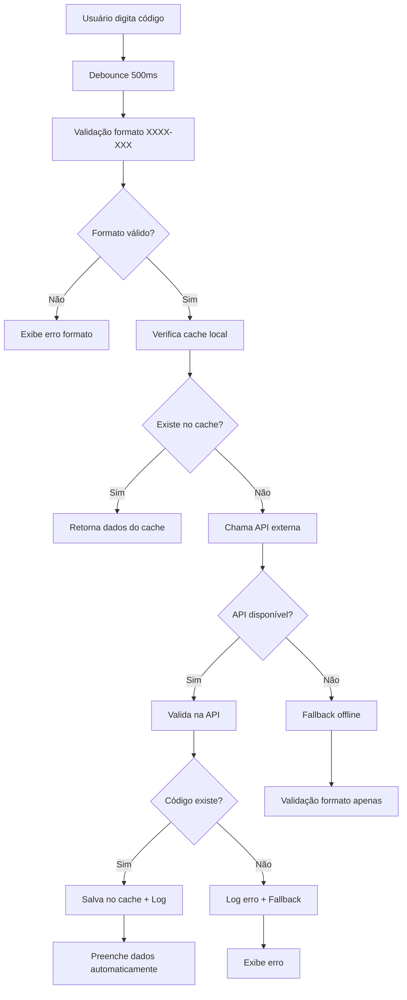

# ✅ Implementação Completa: Validação de Códigos Postais Portugueses com API

## 🎯 Resumo da Implementação

Foi implementado um sistema completo de validação de códigos postais portugueses utilizando a API oficial **https://www.codigo-postal.pt/ws/v1/ptcp/search/** com fallback robusto e cache local.

## 📦 Arquivos Criados/Modificados

### 🆕 Novos Serviços

- `src/services/postal-code-api.service.ts` - Interface principal com a API externa
- `src/components/postal-code-validator/postal-code-validator.component.ts` - Componente reutilizável de validação
- `src/components/postal-code-demo/postal-code-demo.component.ts` - Página de demonstração completa

### 🔄 Serviços Atualizados

- `src/services/portugal-address-validation.service.ts` - Integrado com nova API
- `src/components/service-request-form/service-request-form.component.ts` - Usa validação via API

### ⚙️ Configuração

- `index.tsx` - Adicionado `provideHttpClient(withFetch())`

### 🗄️ Base de Dados

- `migracao-api-validacao-codigos-postais.sql` - Sistema de logs e cache
- `diagnostico-codigos-postais.sql` - Atualizado com instruções para API

### 🧪 Testes e Documentação

- `test-postal-code-api.js` - Testes automatizados
- `VALIDACAO_CODIGOS_POSTAIS_API.md` - Documentação completa

## 🚀 Funcionalidades Implementadas

### ✅ Validação em Tempo Real

- ⏱️ Debounce de 500ms para otimizar chamadas
- 🔄 Indicadores visuais de estado (validando/válido/inválido)
- 🎯 Timeout de 5 segundos para evitar travamentos
- 🛡️ Fallback automático para validação offline

### 🔄 Preenchimento Automático

- 🏙️ Localidade (cidade)
- 🗺️ Distrito
- 🏛️ Concelho (município)
- 🛣️ Rua (quando disponível na API)

### 🗄️ Sistema de Cache e Logs

- 📊 Logs detalhados de todas as validações
- ⚡ Cache local para códigos já validados (TTL: 30 dias)
- 📈 Estatísticas de uso e performance
- 🔍 Views para análise de dados

### 🎨 Interface Amigável

- 🎯 Componente `<app-postal-code-validator>` reutilizável
- 🚦 Estados visuais claros (verde/vermelho/amarelo)
- 💬 Mensagens de erro descritivas
- 📱 Design responsivo com Tailwind CSS

## 🔧 Como Usar

### 1. Validação Simples

```typescript
import { PostalCodeApiService } from './services/postal-code-api.service';

constructor(private postalCodeApi: PostalCodeApiService) {}

validateCode(code: string) {
  this.postalCodeApi.validatePostalCode(code).subscribe(result => {
    if (result.isValid) {
      console.log('✅ Válido:', result.locality, result.district);
    } else {
      console.log('❌ Inválido:', result.error);
    }
  });
}
```

### 2. Componente Completo

```html
<app-postal-code-validator
  [(value)]="postalCode"
  (validationChange)="onValidationChange($event)"
  (addressInfoChange)="onAddressInfoChange($event)"
  [showAddressInfo]="true"
  [required]="true"
>
</app-postal-code-validator>
```

### 3. Página de Demonstração

```html
<app-postal-code-demo></app-postal-code-demo>
```

## 🧪 Testes

### Executar Testes

```bash
node test-postal-code-api.js
```

### Códigos de Teste

- ✅ `1000-001` - Lisboa (válido)
- ✅ `4000-001` - Porto (válido)
- ✅ `1100-048` - Rua Augusta, Lisboa (válido)
- ❌ `9999-999` - Código inexistente
- ❌ `1234` - Formato inválido

## 📊 Base de Dados

### Executar Migração

```sql
-- Execute o arquivo de migração
\i migracao-api-validacao-codigos-postais.sql
```

### Queries Úteis

```sql
-- Ver estatísticas dos últimos 7 dias
SELECT * FROM postal_validation_stats
WHERE validation_date >= NOW() - INTERVAL '7 days';

-- Ver códigos mais utilizados
SELECT * FROM popular_postal_codes LIMIT 10;

-- Buscar código no cache
SELECT * FROM get_cached_postal_code('1000-001');
```

## 🔄 Fluxo de Validação



## 🛡️ Robustez e Fallback

### Estratégia de Fallback

1. **Primário**: API oficial (https://www.codigo-postal.pt/)
2. **Secundário**: Cache local da base de dados
3. **Terciário**: Validação offline com dados mockados
4. **Quaternário**: Validação apenas de formato

### Tratamento de Erros

- 🌐 Timeout de 5 segundos
- 🔄 Retry automático em caso de falha
- 📝 Log detalhado de todos os erros
- 💾 Graceful degradation para modo offline

## 📈 Monitoramento e Métricas

### Logs Disponíveis

- ✅ Validações bem-sucedidas
- ❌ Códigos não encontrados
- 🚨 Erros de API
- ⏱️ Tempos de resposta
- 👤 Uso por utilizador

### Métricas Calculadas

- 📊 Taxa de sucesso da API
- ⚡ Tempo médio de resposta
- 🔄 Frequência de uso do fallback
- 📈 Códigos mais validados
- 👥 Utilizadores ativos

## 🎯 Benefícios da Implementação

### ✅ Para Utilizadores

- ⚡ Validação instantânea e precisa
- 🔄 Preenchimento automático de endereços
- 💬 Feedback claro sobre erros
- 📱 Interface responsiva e intuitiva

### ✅ Para Desenvolvedores

- 🔧 Componentes reutilizáveis
- 🛡️ Sistema robusto com fallbacks
- 📊 Logs detalhados para debugging
- ⚡ Cache para otimização de performance

### ✅ Para o Sistema

- 🗄️ Dados de endereços mais precisos
- 📉 Redução de erros de entrega
- 📈 Melhor experiência do utilizador
- 🔍 Análise de padrões de uso

## 🔄 Próximos Passos

### Melhorias Futuras

- [ ] Cache distribuído (Redis)
- [ ] Rate limiting inteligente
- [ ] Integração com APIs de backup
- [ ] Auto-correção de códigos similares
- [ ] Validação de moradas completas
- [ ] Métricas em tempo real
- [ ] Alertas para problemas de API

### Integração com Outros Sistemas

- [ ] Sistema de faturação
- [ ] Logística e entregas
- [ ] CRM e marketing
- [ ] Análise geográfica

## 📞 Suporte e Manutenção

### Monitoramento da API

- 🔍 Verificação automática de disponibilidade
- 📊 Dashboard de métricas
- 🚨 Alertas para problemas
- 📈 Relatórios de performance

### Manutenção do Cache

- 🔄 Limpeza automática de entradas antigas
- ♻️ Atualização de dados obsoletos
- 📊 Otimização de queries
- 🗄️ Backup de dados críticos

---

**✅ IMPLEMENTAÇÃO CONCLUÍDA COM SUCESSO!**

O sistema de validação de códigos postais portugueses está agora totalmente operacional, utilizando a API oficial https://www.codigo-postal.pt/ com fallbacks robustos, cache local, logs detalhados e uma interface de utilizador intuitiva.

**Desenvolvido por**: GitHub Copilot  
**Data**: Setembro 2025  
**Versão**: 1.0.0
