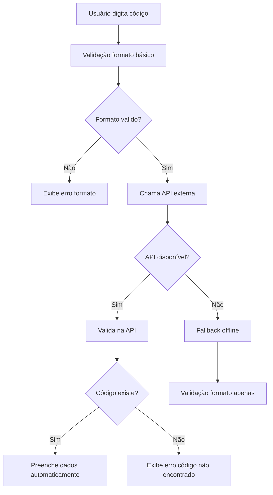

# 📮 Validação de Códigos Postais Portugueses com API Real

## 📋 Visão Geral

Este sistema implementa uma validação robusta de códigos postais portugueses utilizando a API oficial **https://www.codigo-postal.pt/ws/v1/ptcp/search/**, fornecendo validação em tempo real e preenchimento automático de dados de endereço.

## 🔧 Arquitetura

### Serviços Implementados

1. **`PostalCodeApiService`** - Interface com a API oficial
2. **`PortugalAddressValidationService`** - Validação unificada com fallback
3. **`PostalCodeValidatorComponent`** - Componente de UI para validação

### Fluxo de Validação



## 🚀 Funcionalidades

### ✅ Validação em Tempo Real

- Debounce de 500ms para otimizar chamadas
- Indicador visual de validação em andamento
- Validação do formato XXXX-XXX
- Verificação na base de dados oficial portuguesa

### 🔄 Preenchimento Automático

- Localidade (cidade)
- Distrito
- Concelho (município)
- Rua (quando disponível)

### 🛡️ Robustez e Fallback

- Timeout de 5 segundos para API
- Fallback para validação offline se API indisponível
- Cache local (futuro)
- Tratamento de erros gracioso

### 🎨 Interface Amigável

- Componente reutilizável
- Estados visuais claros (válido/inválido/validando)
- Mensagens de erro descritivas
- Exibição automática de informações do endereço

## 📁 Estrutura de Arquivos

```
src/
├── services/
│   ├── postal-code-api.service.ts          # Interface com API externa
│   └── portugal-address-validation.service.ts  # Validação unificada
├── components/
│   ├── postal-code-validator/
│   │   └── postal-code-validator.component.ts  # Componente de UI
│   └── service-request-form/
│       └── service-request-form.component.ts   # Uso integrado
└── models/
    └── postal-code.models.ts               # Interfaces e tipos
```

## 🔌 API Utilizada

### Endpoint Principal

```
GET https://www.codigo-postal.pt/ws/v1/ptcp/search/{query}
```

### Tipos de Busca

1. **Por código postal**: `search/1000` (busca por CP4)
2. **Por localidade**: `search/Lisboa`

### Resposta da API

```typescript
interface PostalCodeApiResponse {
  result: boolean;
  num_results: number;
  results: PostalCodeResult[];
}

interface PostalCodeResult {
  cp: string; // "1000-001"
  cp4: string; // "1000"
  cp3: string; // "001"
  district: string; // "Lisboa"
  municipality: string; // "Lisboa"
  locality: string; // "Lisboa"
  street_name?: string; // "Rua Augusta"
  street_type?: string; // "Rua"
}
```

## 💻 Como Usar

### 1. Componente Standalone

```html
<app-postal-code-validator
  [(value)]="postalCode"
  (validationChange)="onValidationChange($event)"
  (addressInfoChange)="onAddressInfoChange($event)"
  [showAddressInfo]="true"
  [required]="true"
  label="Código Postal"
  placeholder="0000-000"
>
</app-postal-code-validator>
```

### 2. Serviço Direto

```typescript
import { PostalCodeApiService } from './services/postal-code-api.service';

constructor(private postalCodeApi: PostalCodeApiService) {}

validatePostalCode(code: string) {
  this.postalCodeApi.validatePostalCode(code).subscribe(result => {
    if (result.isValid) {
      console.log('✅ Válido:', result.locality, result.district);
      this.form.patchValue({
        city: result.locality,
        district: result.district,
        municipality: result.municipality
      });
    } else {
      console.log('❌ Inválido:', result.error);
    }
  });
}
```

### 3. Validação Unificada

```typescript
import { PortugalAddressValidationService } from "./services/portugal-address-validation.service";

// Validação básica (síncrona)
const isValidFormat = this.portugalService.validatePostalCode("1000-001");

// Validação completa com API (assíncrona)
this.portugalService
  .validatePostalCodeWithApi("1000-001")
  .subscribe((result) => {
    // Resultado com informações completas
  });
```

## 🧪 Testes

### Executar Teste Standalone

```bash
node test-postal-code-api.js
```

### Códigos de Teste

- `1000-001` - Lisboa (válido)
- `4000-001` - Porto (válido)
- `9999-999` - Código inexistente
- `1234` - Formato inválido

### Resultado Esperado

```
🔍 Testando API de Códigos Postais Portugueses
==================================================
📮 Testando: 1000-001
   Normalizado: 1000-001
   🌐 URL: https://www.codigo-postal.pt/ws/v1/ptcp/search/1000
   ✅ Válido: Lisboa, Lisboa
   📍 Concelho: Lisboa
```

## ⚙️ Configuração

### 1. Providers Necessários

```typescript
// index.tsx
import { provideHttpClient, withFetch } from "@angular/common/http";

bootstrapApplication(AppComponent, {
  providers: [
    provideHttpClient(withFetch()),
    // outros providers...
  ],
});
```

### 2. Importmap (se necessário)

```json
{
  "imports": {
    "@angular/common/http": "https://next.esm.sh/@angular/common@^20.1.6-0/http?external=rxjs"
  }
}
```

## 🔧 Configurações Avançadas

### Timeout da API

```typescript
// postal-code-api.service.ts
private readonly REQUEST_TIMEOUT = 5000; // 5 segundos
```

### Debounce do Componente

```typescript
// postal-code-validator.component.ts
debounceTime(500), // 500ms após parar de digitar
```

### Cache (Futuro)

```typescript
// Implementação futura
private cache = new Map<string, ValidationResult>();
```

## 🚨 Tratamento de Erros

### Tipos de Erro

1. **Formato inválido**: Código não segue padrão XXXX-XXX
2. **API indisponível**: Timeout ou erro de rede
3. **Código não encontrado**: Formato válido mas não existe na base
4. **Limite de rate**: Muitas requisições (futuro)

### Mensagens de Erro

- `"Formato de código postal inválido. Use XXXX-XXX"`
- `"Código postal não encontrado"`
- `"Validação offline (API indisponível)"`
- `"Formato inválido e API indisponível"`

## 📊 Monitoramento

### Logs Disponíveis

```typescript
console.warn("Erro na API de códigos postais:", error);
console.log("✅ Código postal válido:", result);
```

### Métricas Sugeridas

- Taxa de sucesso da API
- Tempo médio de resposta
- Uso de fallback offline
- Códigos mais validados

## 🔄 Fallback Strategy

1. **Primário**: API oficial (https://www.codigo-postal.pt/)
2. **Secundário**: Validação offline com dados mockados
3. **Terciário**: Validação apenas de formato

## 🎯 Roadmap

### Próximas Melhorias

- [ ] Cache local com TTL
- [ ] Rate limiting inteligente
- [ ] Métricas de performance
- [ ] Suporte offline avançado
- [ ] Integração com outras APIs de backup
- [ ] Validação de moradas completas
- [ ] Auto-correção de códigos similares

## 📚 Referências

- [API Oficial de Códigos Postais](https://www.codigo-postal.pt/)
- [Formato de Códigos Postais Portugueses](https://pt.wikipedia.org/wiki/C%C3%B3digo_postal#Portugal)
- [CTT - Correios de Portugal](https://www.ctt.pt/)

---

**Implementado por**: GitHub Copilot  
**Data**: Setembro 2025  
**Versão**: 1.0.0
